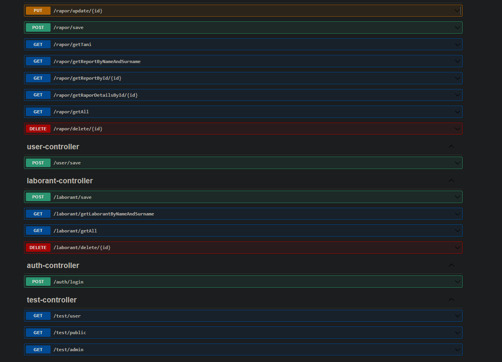
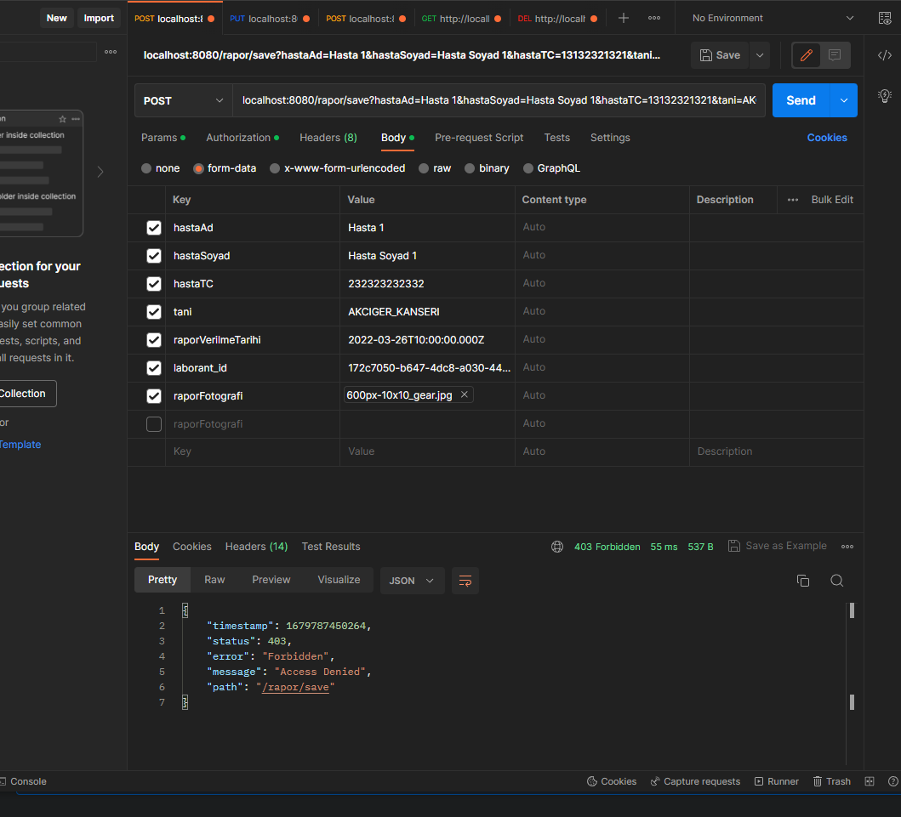
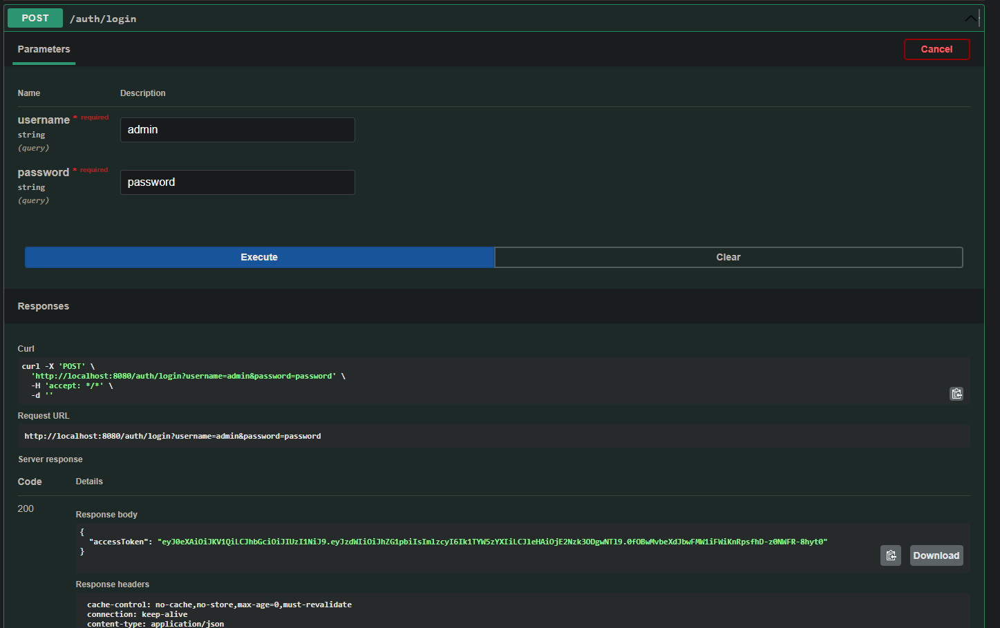
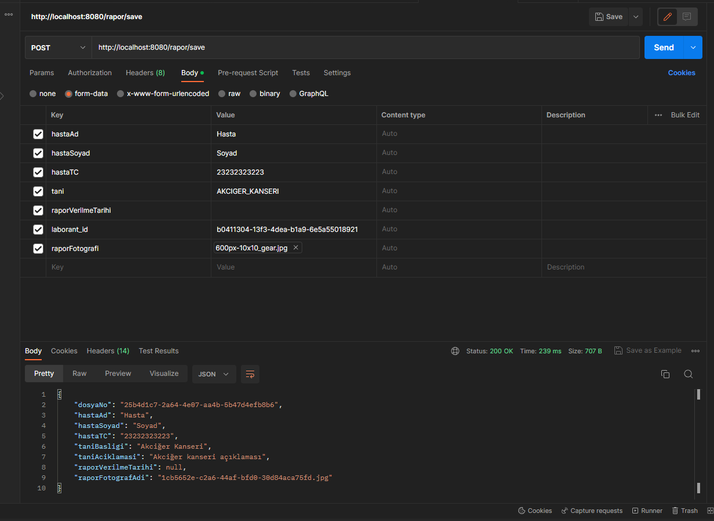

# Laborant Uygulaması

Tüm docker repository için: [Docker](https://hub.docker.com/repositories/mustafasansar44 "Docker Repositorylerim")


Uygulamamın frontend'i için [Laborant Frontend](https://github.com/mustafasansar44/laborant-frontend)

```
Projemin image'i için pull edebilirsiniz;

Merhaba, projemi çalıştırabilmek için PostgreSQL veritabanının yüklü olması gerekiyor. 
(Postgres:15.2 kullandım port 5432)

Veritabanını hallettikten sonra
docker veya target altındaki derlenmiş projeyi
java -jar laborant-0.0.1-SNAPSHOT.jar 
şeklinde çalıştırabilirsiniz. Eğer port çakışması olursa
java -jar laborant-0.0.1-SNAPSHOT.jar --server.port=8888

```




```
Api endpointleri bu şekilde.
Bazı endpointlere istek atabilmek için User ya da Admin rolüne sahip bir kullanıcının /auth/login
endpointi ile sisteme giriş yapması gerekiyor daha sonra JWT tokeni alıp (hangi programı kullanıyorsanız 
ben Postman için söyleyeceğim.) 

'Authorization' penceresine gelip 'Type' sekmesinden 'Bearer Token' i seçip sağ kısımdaki token kutusuna tokeni
gönderdikten sonra isteklerinizi atabilirsiniz. 

Aşağıdaki test-controller sınıfında da sınıfa göre getRequest atabileceğiniz endpointler mevcut api'yi 
geliştirirken test edeyim diye eklemiştim development sürecinde olduğu için öyle bıraktım.

'/rapor/delete', '/rapor/update' 
endpointlerine istek atabilmek için Admin,
'/rapor/save', '/rapor/getRaporDetailsById/**',  '/test/user', '/laborant/save' 
istek atabilmek için User ya da Admin rolünde olmak gerekiyor.
```
```
Rapor kaydederken ek parametre olarak resim dosyası istiyor. Bu resim dosyalarını frontend klasörüne
atması için application.properties dosyasında kaydedeceği yolu verdim oradan değiştirilebilir.

JsonWebToken için gereken parametreler de application.properties içerisinde.
```

### OpenAPI ve Postman ile birkaç istek gönderelim


```
Burada tokensiz yapılan isteğe Access Denied hatası alıyoruz.
Login olup tekrar deneyelim.
```

```
Access Tokeni Postman'a ekleyip birdaha deneyelim.
```

```
Tarihin null olmasının nedeni postman ile tarih gönderemememden kaynaklı :)
Bunu frontend'de gönderilen istekte halledeceğim için burada çok önem vermedim.
```
